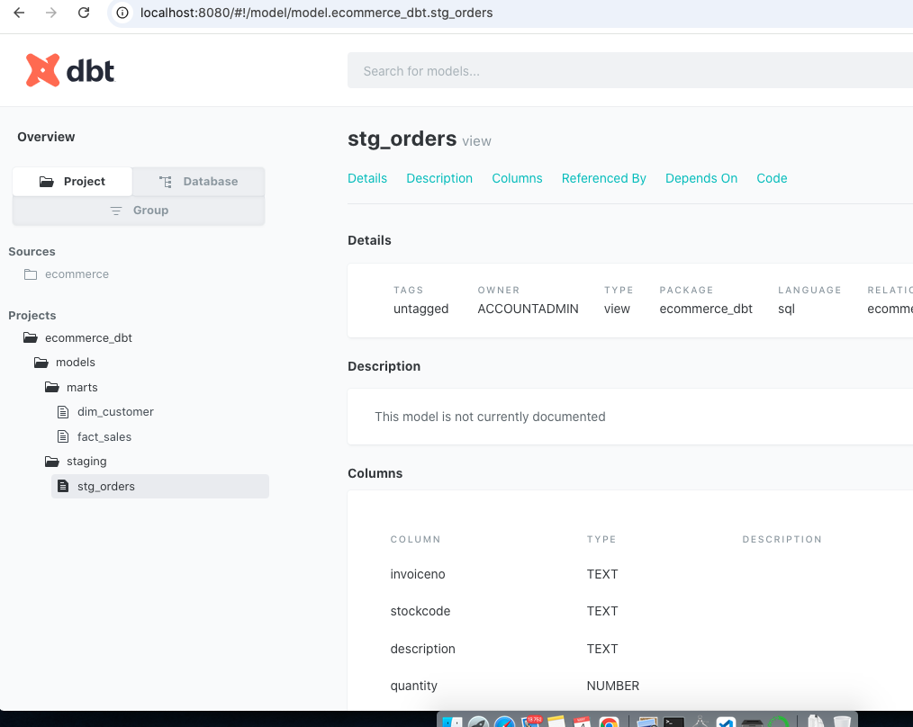
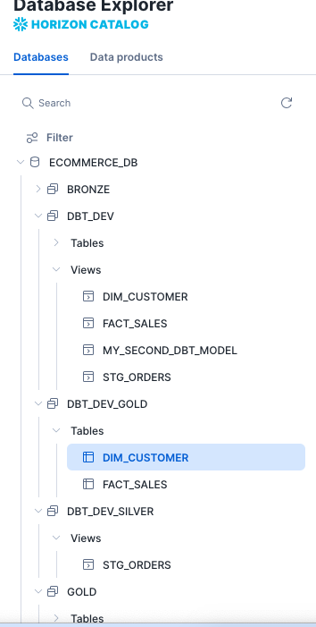
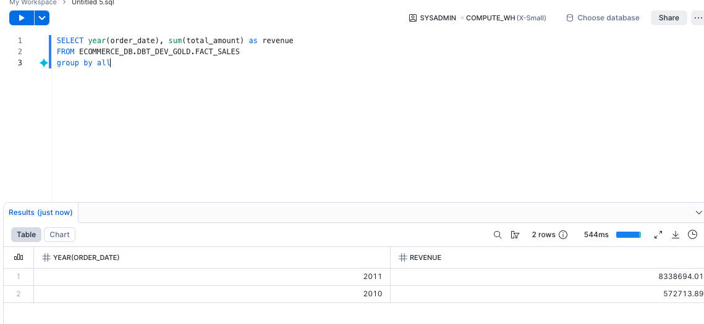

# 🛒 End-to-End Retail Data Warehouse (dbt + Snowflake)

## 📌 Overview

This project demonstrates the design and implementation of a **modern data warehouse** using **Snowflake** and **dbt**, following the **Medallion Architecture (Bronze → Silver → Gold)**.

Raw transactional data is ingested, cleaned, transformed, and modeled into a **star schema** to support analytics and reporting.

---

## 🏗️ Architecture


```
Raw CSV Data
     ↓
Snowflake (Bronze Layer)
     ↓
dbt Staging Models (Silver Layer)
     ↓
dbt Marts (Gold Layer - Star Schema)
```

---

## 🧱 Data Model (Star Schema)


### ⭐ Fact Table

* **fact_sales** → transactional sales data (revenue, quantity)

### 📦 Dimension Tables

* **dim_customer** → customer lifecycle & lifetime value
* **dim_product** → product details
* **dim_date** → date breakdown for time-based analysis

---

## ⚙️ Tech Stack

* **Snowflake** → cloud data warehouse
* **dbt** → data transformation & modeling
* **SQL** → transformation logic
* **Git & GitHub** → version control

---

## 🔄 Pipeline Overview

### 1. Bronze Layer

* Raw data loaded into Snowflake (`orders_raw`)

### 2. Silver Layer (dbt staging)

* Cleaned data:

  * removed null customers
  * filtered invalid quantities & prices
  * removed cancelled invoices
  * created derived column: `total_amount`

### 3. Gold Layer (dbt marts)

* Built **fact + dimension tables**
* Optimized for analytics queries

---

## 🚀 Key Features

* ✅ Modular dbt models (staging → marts)
* ✅ Star schema design for analytics
* ✅ Incremental model for performance optimization
* ✅ Data quality tests (dbt tests)
* ✅ Auto-generated documentation & lineage graph

---

## ⚡ Incremental Model

The `fact_sales` model is implemented as an **incremental model** to process only new data:

```sql
{{ config(
    materialized='incremental',
    unique_key='INVOICENO'
) }}

SELECT *
FROM {{ ref('stg_orders') }}


WHERE order_date > (SELECT MAX(order_date) FROM {{ this }})

```

---

## 📊 Example Analysis

### Revenue by Month

```sql
SELECT
    d.year,
    d.month,
    SUM(f.total_amount) AS revenue
FROM gold.fact_sales f
JOIN gold.dim_date d
    ON f.order_date = d.order_date
GROUP BY d.year, d.month
ORDER BY d.year, d.month;
```

---

## 📸 Screenshots

### 🔹 dbt DAG (Lineage Graph)


### 🔹 DBT


### 🔹 Snowflake Tables (Gold Layer)



### 🔹 Sample Query Output



---

## 🧪 How to Run

```bash
# Run models
dbt run

# Run tests
dbt test

# Generate docs
dbt docs generate

# View docs
dbt docs serve
```

---

## 🧠 Key Learnings

* Designed a scalable data warehouse using Medallion Architecture
* Built modular data pipelines with dbt
* Implemented incremental processing for efficiency
* Applied dimensional modeling (star schema)
* Ensured data quality with testing

---

## 📂 Project Structure

```
models/
├── staging/
│   └── stg_orders.sql
└── marts/
    ├── fact_sales.sql
    ├── dim_customer.sql
    ├── dim_product.sql
    └── dim_date.sql
```

---

## 📬 Contact

If you found this useful or want to collaborate, feel free to connect!
